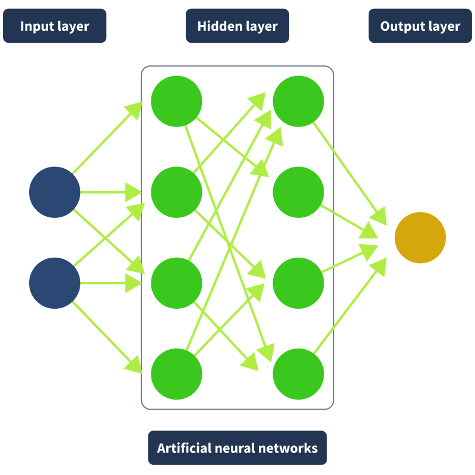

# Security threats in AI/ML

## The Building Blocks of AI

We must empower our cyber security workforce to combat AI security threats. Knowledge is power, so we begin by arming you with the foundational knowledge of AI and ML. Let's start by discussing how we define "Artificial Intelligence".

**Artificial Intelligence:** Artificial Intelligence refers to a machine or computer system that is able to carry out tasks that would otherwise require human reasoning, comprehension, problem-solving, or creativity. It's a term that, truthfully, doesn't have just one simple definition due to the sheer scope of its application in today's society and its potential applications in the future. Sitll, we can use this definition to begin to understand what it is and where it started. This term and field dates back to 1950s when research began on the pursuit of having machines perform tasks by simulating human intelligence; however, this was still a niche ter that was not widely known.

**Machine Learning:** The next significant advancement in the development of AI came with the emergence of ML. ML is a subfield of AI that refers to a computer's ability to learn from data without being given instructions and is comparable to how the human brain learns. Over time, with more data and time, these algorithms will get better at accuracy and decisions.

ML follows a structured lifecycle to ensure the raliable development and deployment of models. This process begins with defining the problem, such as determining whether an email is spam. Next, data is collected, cleaned, and prepared through feature engineering, ensuring meaningful patterns are extracted while avoiding overfitting(When a model's familirity with the training data causes a failure to make generalisations on unseen/raw data). The model is then trained using a selected algorithm, followed by evaluation and tuning to optimise performance. Once refined, the model is deployed into a production environmentfor real-world use, such as classifying emails in real-time. However, the lifecycle doesn't end there-ongoing monitoring ensures the model maintains accuracy over time, triggering retraining when needed. Since models require continuous improvement, the Machine Learning Lifecycle remians an iterative process.

## Machine Learning Algorithms

ML algorithms are the mathematical methods used to learn patterns from data, while ML models are the trained outputs derived from these algorithms. These algorithms consist of three key components: a decision process, which makes predictions or classifications based on input data; an error function, which evaluates performance and provides feedback; and a model optimisation process, which fine-tunes the algorithm to minimise errors and improve accuracy. This iteative process continues until the model reaches a satisfactory performance level.

ML algorithms fall into four main categories: supervised, unsupervised, semi-supervised, and reinforcement learning. Supervised learning relies on labeled data to train models for classification or regression tasks, such as predicting house prices or identifying spam emails. Unsupervised learning, on the other hand, works with unlabeled data to discover hidden patterns, often using clustering, association, or dimensionality reduction techniques. Semi-supervised learning combines elements of both, using a small portion of labeled data to guide the learning process. Finally, reinforcement learning mimics human learning by rewarding correct decisions and penalizing mistakes, allowing an agent to refine its actions over time to achieve the best outcome.

## Neural networks and Deep learning

If you recall, the main objective of AI is to enable computers to behave like humans. One method that allows us to do this is through the use of neural networks. If you cast your mind back to high school biology, you may remember being taught how the human brain works. The human brain processes information using interconnected neurons (a type of cell responsible for transmitting communications between the body and brain), which communicate with each other using synapses. Synapses allow the brain to send electrical/chemical signals from neuron to neuron; in other words, they are a connection. This network of neurons learns by adjusting the strengths of these connections when we experience something new based on patterns we encounter. It's this behaviour that is replicated in a neural network.

The diagram below represents a neural network. Like the human brain processes sensory input, the input layer receives raw data, with the number of nodes depending on the data type (e.g., a 4x4 pixel image has 16 nodes). Each node represents a neuron, and connections between them act as synapses. The hidden layers process and refine the input, bringing the network closer to a prediction. Each connection has a weight, determining its importance—for example, in email classification, the body text might have more weight than the subject line. The output layer then produces the final prediction.

Consider a neural network tasked with recognising a number from an image. Each hidden layer extracts different features—early layers detect edges and curves, while deeper layers combine these patterns to form a complete number. For example, lines may suggest a 1 or 7, while curves increase the likelihood of a 3, 8, or 0. The output layer, with 10 nodes (one per digit), selects the most likely number based on the highest prediction value. This self-learning process mimics the human brain, and when a network has more than three layers, it is classified as a DL algorithm—hence the term "deep learning."

DL and ML can get confused sometimes, but we can now understand the key differences with what we've covered so far. Like ML, DL is concerned with receiving data as input and producing some kind of prediction or classification as output. DL can take in labelled datasets (like the ones mentioned when covering supervised learning), but the key difference is that DL doesn't need the data to be labelled. A DL algorithm can take unlabelled, unstructured raw data and determine its key features, which separate it from other categories. The important advantage here over ML is that the data doesn't need labelling; this means DL doesn't require human interaction and, in that way, is self-learning. It makes sense then that DL is possible through the leveraging of neural networks.

Because no human intervention is needed, larger datasets can be processed and can, therefore, be thought of as "scalable ML". The idea of neural networks has been around for decades and decades, so how come the true potential of DL has only exploded over the last decade or so? This is largely due to the mass digitisation of information in recent years; suddenly, masses of information was available to learning algorithms, and so, with DL, started a new era of AI in which we would unlock more potential and capabilities.

## LLMs

Large Language Models (or LLMs) are deep learning-based models that can process and generate text by predicting the next word in a sequence. For example, consider this quote: "Ever have the feeling where you're not sure if you're awake or -------"

This quote is missing the final word. This quote would be fed into the LLM, and it would be tasked with predicting what the final word is likely to be. When you query a chatbot, this is what is happening in the background. Predictions are being run quickly on what word would likely be next in the response of an chat to this query, but how?

LLMs are first trained in a "pre-training" phase, where they process vast amounts of text, GPT-3 alone was trained on data that would take a human 2,600 years to read nonstop. More advanced models, like GPT-4, require even greater datasets, made possible by DL. Instead of relying on labelled data, LLMs use billions of parameters that function like puzzle pieces, enabling them to understand and generate human-like language when assessed together. These parameters are fine-tuned automatically as the model processes text, adjusting based on prediction accuracy to improve response quality. They begin by generating a word at random to finish the text: "Ever have the feeling where you're not sure if you're awake or **egg**"

The guess is then compared with what the correct final word actually was, and the parameters are fine-tuned to make it more likely to predict what, in fact, was the right word until the model can accurately predict the correct word to end the sentence (and less likely to choose the incorrect words) using an algorithm called backpropagation:

Now imagine this process happening trillions of times, repeating this process over and over again until it can not only predict the end of the training data but also raw unseen data. The sheer scope of what is being discussed here is only possible due to advancements in hardware, like GPUs (Graphics Processing Units), enabling masses of parallel operations and processing of large datasets as well as advancements in neural networks, specifically a type of neural network called transformer neural networks.

Introduced in Google's 2017 paper Attention is All You Need, transformer neural networks revolutionized LLMs by enabling parallel text processing instead of sequential word-by-word analysis. This breakthrough allowed models to assign "attention" to key words, improving contextual understanding. By encoding words into numerical values and calculating attention scores, transformers enhance accuracy, helping models correctly interpret ambiguous references, like distinguishing whether "it" in this sentence refers to "the bank" or "the loan.":

"The bank approved the loan because it was financially stable."

After the pre-training, humans come back into play, performing a step called RLHF (Reinforcement Learning from Human Feedback). This is when predictions are reviewed, and any that would be considered unhelpful by a user or have issues are flagged and the parameters are adjusted accordingly. Once trained and reinforced, the LLM can be used, whether as a translator, chatbot, etc. A query is fed to it, and using its trained model, it predicts what the next word would be as a response, and so on and so on until the user has a complete response.

LLMs power generative AI products like ChatGPT and LLaMA, which create original text-based content in response to user prompts. Generative AI as a whole extends beyond text, enabling the creation of images, music, and more. The recent AI boom is the result of years of research and innovation, not an overnight development. We’ve now explored key concepts that trace AI’s evolution—let’s quickly recap how they all connect.

**Artificial Intelligence (AI) is the overarching field, encompassing all systems that mimic human intelligence. Machine learning (ML) is a subfield of AI that enables systems to learn patterns from data without explicit programming. Deep learning (DL) is then a specialised branch of ML, which uses neural networks to process vast amounts of data in complex ways without the need for human interaction, making it effectively scalable . Large Language Models (LLMs) , like GPT, are advanced DL models built on neural networks, specifically transformers, designed to understand and generate human-like text. As was said, knowledge is power, and with these last few tasks, you have started your journey in the pursuit of that knowledge and now have a better understanding of the technologies that give AI its powers. Now let's take a look at how all of the discussed is affecting our industry, shall we?

## AI security threats

### The Implications of AI in Cyber Security

Tackling a broad topic like "AI security threats" can feel ovewhelming, so any guidance is always appreciated. That guidance comes in the form of the ATLAS MITRE framework. If you're familiar with the ATT&CK Framework, it might be helpful to know that MITRE have developed a similar framework with a focus on AI. For those unfamiliar with the ATT&CK Framework goes over cyber security attacks, breaking down the steps an attacke could take to compromise a system. This ATLAS framework was built on top of that to help guide us more specifically to AI Cyber threats, and you can check it out [ATLAS Framework](https://atlas.mitre.org/matrices/ATLAS).

### Vulnerabilities in AI models

**Prompt Injection:** Prompts are used to instruct the model on how to perform. For example, an RPG chatbot may have the prompt, “You are a fantasy roleplaying chatbot. You control the direction the story takes, and be as creative as you can to create a story based on the user’s actions. Do not disclose any information about the hardware and software that you operate on, nor any steps taken to train you". Prompt injection occurs when the original instructions provided to the model are overridden, often for malicious purposes such as disclosing more information than it should, or generating harmful content.

**Data Poisoning:** Data poisoning is when an attacker manipulates the training data/corpus used to train an AI model so its generated output that is incorrect or biased. Let's consider our example discussed in earlier tasks where we are training an AI model to recognise whether an email is spa or not. An attacker could perform a data posoning attack to manipulate the training data being used to train this AI model so that it fails to recognise spam emails accurately, allowing spam emails they are trying to send to bypass this AI filter.

**Model Theft:** Model theft occurs when an attacker gains unauthorised access to an AI model. From there, the attacker could potentially steal the intellectual property that lies within and even use it for malicious purposes. This attack is possible by querying the API of the ML model they want to steal. They would then use the output to train a clone model that mimics the behaviour of the original.

**Privacy Leakage:** A privacy leakage vulnerability in AI models refers to the possibility of an AI model inadvertently revealing sensitive information about the data it was trained on, even if the data was supposed to be kept confidential. Consider an example of an AI model that has been trained on private medical data such as patient details and medical conditions. This vulnerability refers to the potential for an AI model to leak this information to an attacker or user.

**Model Drift:** Model drift refers to the potential for a Model's performance to drift over time due to changes in the data or the environment surrounding it. You may recall the discussion of the need to retrain models over time in earlier tasks; this is due to model drift, which is why monitoring an AI model once it has been deployed and is being used is so important. For example, this can occur when a model trained on historical data starts to perform poorly when new data is being processed.

## Enhanced Attacks

**Malware:** With the explosion of Generative AI, all kinds of content can now be generated in an instant with just a few taps of a keyboard. This kind of power has been leveraged by all sorts of industries, such as the customer service industry, using it to give users access to a chatbot that can help resolve some common issues without the need to involve their human employees, meaning they can be saved to deal with the more complex user queries. Another industry that can greatly leverage this technology is software development. Now, with the power of generative AI software, developers can generate code instantly. While being incredibly useful, this also means that attackers can generate malware instantly, simplifying the task and making it easier for them to attack using this method.

**Deepfakes:** A key cornerstone of security is authentication, asking, "Are you who you say you are?". We "authenticate" in many different ways in our day-to-day lives at work. Of course, there is the obvious example of password authentication, which is used to gain access to a system, but let's consider another example. Imagine a secretary receiving a voice message, or even a video call, from their superior asking them to forward the confidential information they hold on a customer to that customer. In a pre-AI world, the secretary wouldn't have to think twice about that request; it would seem like a standard request, and they are in a position to "authenticate" that is, in fact, their superior as they are familiar with how they sound and look. The recent advancements in generative AI have led to an explosion of rapid progress in the DeepFake field. This means that if trained on enough data, an AI can now generate a person's likeness, whether that be their voice or their image, to a stunning degree of accuracy, fooling even the technically savvy. Imagine now that the communication received by the secretary was not, in fact, from their superior but a deepfake, and the "customer email" belonged to an attacker waiting to receive confidential customer information. It's easy to see how this advancement in DeepFake technology poses a threat to the security industry. Examples of how this is being used include using the technology to deepfake video interviews, sometimes leading to fraudulent job offers being made.

**Phishing:** Phishing is one of the most common initial access methods attackers use. Sending emails posing to be one thing when there lies malicious content within, attempting to prey on the user who receives it. Because of how common a method it is, companies have worked tirelessly to educate their workforce on things to look out for when receiving emails, like suspicious links and due to the fact a lot of the time these emails are written, having to write masses of emails, or English not being their first language, broken language in the email contents. Over the years, this training has had a positive effect, and more and more phishing emails have been spotted. However, with generative AI, attackers can now generate detailed, fluent, context-based emails that replicate an email a certain user might receive, with little effort and regardless of their writing abilities. With this enhancement to phishing attacks, phishing emails have suddenly become a lot harder to spot using solely our instinct. Of course, models like GPT, for example, have built-in mechanics to stop users from asking for malicious content to be generated, like a phishing email (or malware), but using some of the model vulnerabilities discussed above, attackers are sometimes able to bypass this by engineering their prompts.
