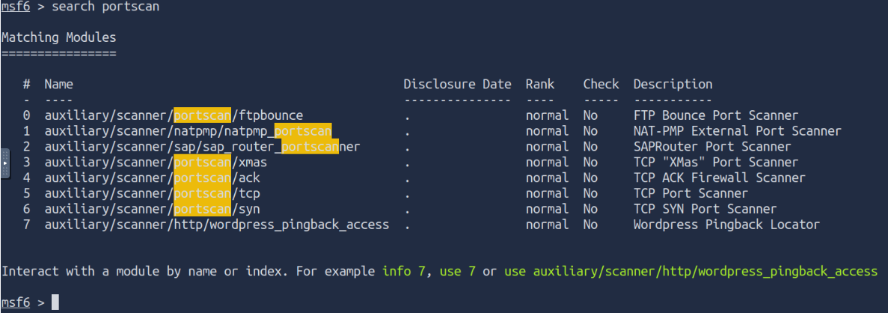
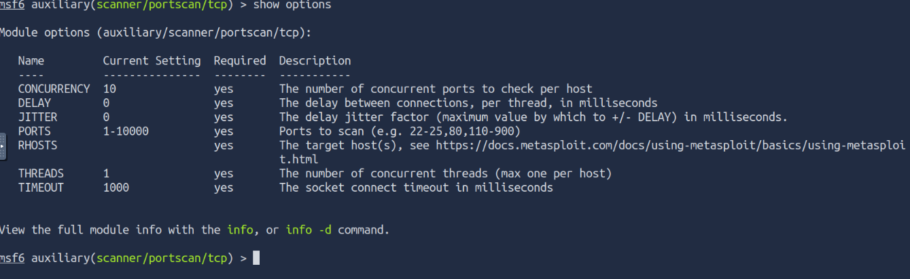
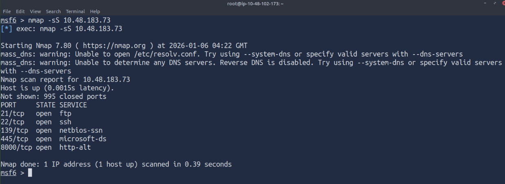

# In this file I'll note my learning from the [tryhackme](https://tryhackme.com) [Metasploit: Exploitation](https://tryhackme.com/room/metasploitexploitation)

## Scanning

### Port Scanning

Port Scanning is the most comming and basic thing to do in the enumeration phase of the attack. Metasploit has a number of modules to scan open ports on the target system and network. You can list potential port scanning modules available using the ```search portscan``` command in the ```msfconsole```.



Portscanning module will require you to set a few options.



* CONCURRENCY: Number of targets to be scanned simultaneously.
* PORTS: Port range to be scanned. Please note that 1-1000 here will not be the same as using Nmap with the default configuration. Nmap will scan the 1000 most used ports, while Metasploit will scan port numbers from 1 to 1000.
* RHOSTS: Target or target network to be scanned.
* THREADS: Number of threads that will be used simultaneously. More threads will result in faster scans.

We can directly perform Nmap scans from the msfconsole prompt as shown below faster: 



