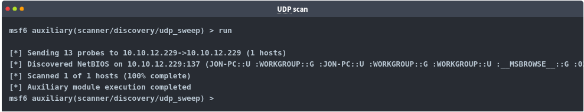
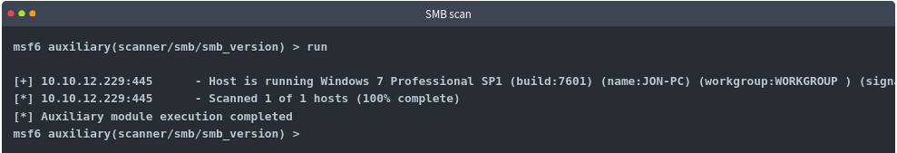
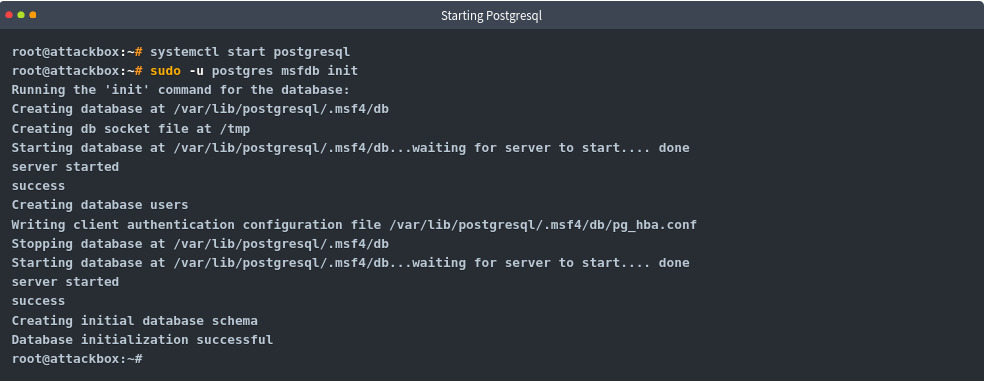
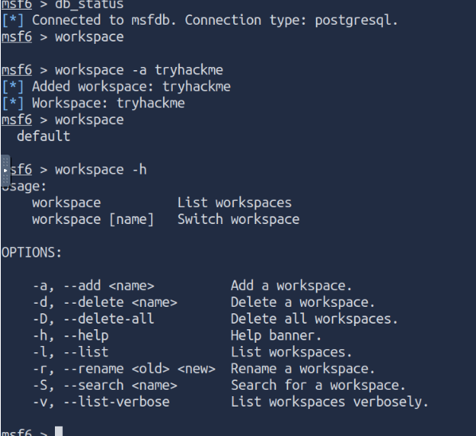

# In this file I'll note my learning from the [tryhackme](https://tryhackme.com) [Metasploit: Exploitation](https://tryhackme.com/room/metasploitexploitation)

## Scanning

### Port Scanning

Port Scanning is the most comming and basic thing to do in the enumeration phase of the attack. Metasploit has a number of modules to scan open ports on the target system and network. You can list potential port scanning modules available using the ```search portscan``` command in the ```msfconsole```.


Portscanning module will require you to set a few options.


* CONCURRENCY: Number of targets to be scanned simultaneously.
* PORTS: Port range to be scanned. Please note that 1-1000 here will not be the same as using Nmap with the default configuration. Nmap will scan the 1000 most used ports, while Metasploit will scan port numbers from 1 to 1000.
* RHOSTS: Target or target network to be scanned.
* THREADS: Number of threads that will be used simultaneously. More threads will result in faster scans.

We can directly perform Nmap scans from the msfconsole prompt as shown below faster:


NB: As for information gathering, if your engagement requires a speedier approach to port scanning, Metasploit may not be your first choice. However, a number of modules make Metasploit a useful tool for scanning phase.

### UDP service Identification

The ```scanner/discovery/udp_sweep``` module will allow you to quickly identify services running over the UDP (User Datagram Protocol). As you can see below, this module will not conduct an extensive scan of all possible UDP services but does provide a quick way to identify services such as DNS or NetBIOS.



### SMB Scans

Metasploit offers several useful auxiliary modules that allow us to scan specific services. Below is an example for the SMB. Especially useful in a corporate network would be ```smb_enumshares``` and ```smb_version``` but please spend some time to identify scanners that the Metasploit version installed on your system offers.



When performing service scans, it would be important not to omit more "exotic" services such as NetBIOS (Network Basic Input Output System), similar to SMB, allows computers to communicate over the network to share files or send files to printers. The NetBIOS name of the target system can give you an idea about its role and even importance (e.g. CORP-DC, DEVOPS, SALES, etc.). You may also run across some shared files and folders that could be accessed either without a password or protected with a simple password (e.g. admin, administrator, root, toor, etc.).

Remember, Metasploit has many modules that can help you have a better understanding of the target system and possibly help you find vulnerabilities. It is always worth performing a quick search to see if there are any modules that could be helpful based on your target system.

## The Metasploit Database

Metasploit has a database function to simplify project management and avoid possible confusion when setting up parameter values.

You will first need to start the PostgreSQL database, which Metasploit will use the following command: ```systemctl start postgresql```

Then you will need to initialize the Metasploit Database using ```msfdb init``` command. However, trying to run ```msfdb init``` as root will give the following error message, "Please run msfdb as a non-root user." This can be solved by running it as the postgres account using ```sudo -u portgres msfdb init```.

The figure below shows the example output. As mentioned, the steps below have already been performed on the AttackBox; however, if you are interested in repeating them you will need to delete the existing database first using ```sudo -u postgres msfdb delete```.



We can launch ```msfconsole``` and check the database status using the ```db_status``` command. The database feature will allow you to create workspaces to isolate different projects. When first launched, you should be in the default workspace. You can list available workspaces using the ```workspace``` command. You can add a workspace using the ```-a``` parameter or delete a workspace using the ```-d``` parameter, respectively. You will also notice that the new database name is printed in red, starting with a ```*``` symbol. You can use the workspace command to navigate between workspaces simply by typing ```workspace``` followed by the desired workspace name. You can use the ```workspace -h``` command to list available options for the ```workspace``` command. Different from regular Metasploit usage, once Metasploit is launced with a database, the ```help``` command, you will see the Database Backends Commands menu.



if you run a Nmap scan using the ```db_nmap```, then all results will be saved to the database.

Now you can use ```hosts```, ```services```, etc commands to know details about your scans.

## Vulnerability Scanning

Metasploit allows you to quickly identify some critical vulnerabilities that could be considered as "low hanging fruit". The term "low hanging fruit" usually refers to easily identifiable and exploitable vulnerabilities that could potentially allow you to gain a foothold on a system and, in some cases, gain high-level privileges such as root or administrator.

Finding vulnerabilities using Metasploit will rely heavily on your ability to scan and fingerprint the target. The better you are at these stages, the more options Metasploit may provide you. For example, if you identify a VNC service running on the target, you may use the search function on Metasploit to list useful modules. The results will contain payload and post modules. At this stage, these results are not very useful as we have not discovered a potential exploit to use just yet. However, in the case of VNC, there are several scanner modules that we can use.
