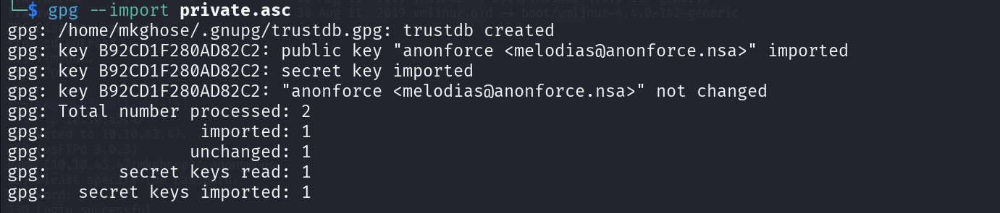

# Writeup for anonforce CTF challenge by tryhackme

First we start the target machine and grab the ip address, then we run enumeration on the machine to know which ports are open and the services running under.

## $nmap -sC -sV -p- -T4 machine_ip

## finding the user flag.

**From the image we can see that we have 2 open ports namely(21, for ftp and 22 for ssh)** The enumeration shows that anonymous login to ftp is allowed so we will try to login anonymously to the ftp server and look into it further.

## $ftp server_ip

Anonymous login is successful. Now we will list all the directories in the ftp server. 

It seems that this is the root i.e / directory of the linux server, now we go into /home directory and see that there is one user home available (i.e melodias). So we go inside the melodias directory and we find the user.txt file from which we can get our first flag.

## Finding the root flag

Now we opt for finding a way to break into the system. As we know there is ssh service available from our enumeration so we search for any .ssh directory in the user home directory but we couldn't find any. So, we come back to the root directory and after exploring all the directory listing we find an interesting directory named notread. Inside notread we find two file.

We take this two file into our local system by get command. 

## $get backup.pgp private.asc

We can see that the private.asc is a pgp private key file. And backup.pgp is a data file which is encrypted with pgp. So, we need a way to get the pgp password. 

We can resort to gpg2john to convert the private keyblock file to john readable hash. 

Then we will try using the jhon hash breaker with rockyou.txt and see if we can break the password.

Now we can import the pgp key to our keychain.

Then we can decrypt the backup data file.

From the view of the file we can see that this is a shadow file of the system. We are very lucky to have found this. Now copy the root hash to roothash.txt file and we can use john the repear on the hash or we can also use hashcat on the hash. 

And voila we got the root password now we can log into the system as root and can find the root flag.

That's the end of this writeup.
